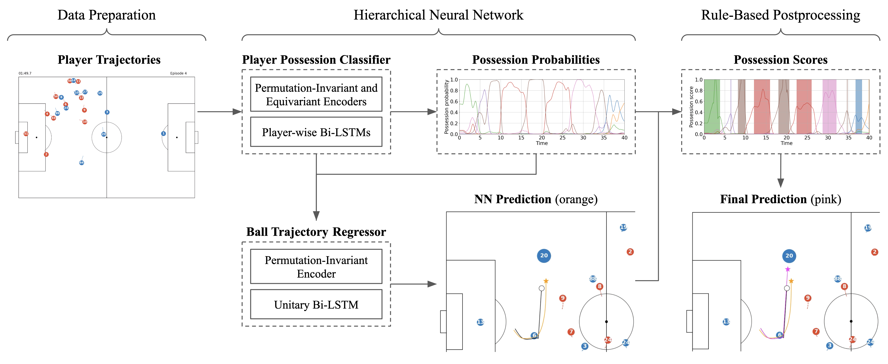

<div align="center">
	<h1>
		Ball Radar
	</h1>
</div>
<!-- # Ball Radar -->

Source code for the paper **Ball Trajectory Inference from Multi-Agent Sports Contexts Using Set Transformer and Hierarchical Bi-LSTM** by Kim et al., 2023. (under review)

## Introduction
**Ball Radar** is a framework for ball trajectory inference from player trajectories in soccer matches. The main model has a hierarchical structure containing the *Ball Possessor Classifier* that predicts which player has the ball at each time step and the *Ball Trajectory Regressor* that predict the final ball trajectory conditioned on the players' possession probabilities. Each of the submodels deploys [Set Transformers](https://arxiv.org/abs/1810.00825) (Lee et al., 2019) to get permutation-invariant or equivariant representations of multi-agent contexts and a Bi-LSTM (or Bi-LSTMs) for sequential inference. Additionally, we perform rule-based postprocessing to make the model output more physically realistic. The following figure is an overview of the framework.<br>

<br>

## Installation and Setup
We have implemented the code using Python 3.10 and PyTorch 1.13.0.

After cloning the repository, you need to install the packages listed in `requirements.txt`.
```
$ pip install -r requirements.txt
```

## Data Usage
For this study, we have used a mixed dataset including the following:

- Fitogether data: 15 matches of GPS tracking data combined with the corresponding event data provided by [Fitogether](https://www.fitogether.com).
- Metrica data: 3 matches of publicly available optical tracking and event data provided by [Metrica Sports](https://metrica-sports.com).

Unfortunately, we cannot share the Fitogether data because it is the company's internal information, but every process can be reproduced using Metrica data with little performance degradation. (See Table 5 of the paper.) We have attached the preprocessed version of the Metrica event data to `data/metrica_events/` and uploaded that of the Metrica tracking data to my [Google Drive](https://drive.google.com/drive/u/1/folders/1xFSHaaIcyyuNplUUF4da9KVOFPiAIO6B). To execute the code, you should download the tracking data files from the drive and locate them in `data/metrica_traces/`.

For your reference, we have also attached the preprocessing code in `datatools/metrica_data_processing.ipynb`. That is, you can regenerate the preprocessed data files on your own by downloading the raw Metrica data from the [original repository](https://github.com/metrica-sports/sample-data), locating the CSV files in `data/metrica_traces/Sample_Game_X` for each game, and executing `datatools/metrica_data_processing.ipynb`.

## Running the Code
To train the model, you can run `scripts/player_ball.sh` using the following command on the terminal:
```
$ sh scripts/player_ball.sh
```
Also, you can train the other models that we introduced in Section 4.2 of the paper, by running `scripts/direct_ball.sh`, `scripts/team_ball.sh`, and so on. As a result, the model weights, hyperparameters, and the training log will be saved in `saved/<trial_id>/`.

To evaluate the model performance, please run `model_eval.ipynb` which can reproduce the results of Section 4.4 and Section 4.5.

## Animating Match Scenes
For interpretability, we have implemented a tool named `TraceAnimator` for dynamically visualizing soccer match tracking data. It animates multiple types of trajectories, including true player and ball trajectories and the predicted trajectories generated from different steps. We have attached a sample 5-minute animation (`img/metrica_match2_00.00-05.00.mp4`) resulting from applying our model to a match in the Metrica dataset, respectively. Both animations include the following:

- player trajectories (red and blue circles with numbers inside)
- true ball trajectory (white circle)
- output of the ball trajectory regressor (orange star)
- predicted ball trajectory after the postprocessing (green star)

<br>

You can animate an arbitrary slice of Metrica data by importing the class `TraceAnimator` in `datatools/trace_animator.py`, making a class object, and executing the method `run()`. Please refer to `model_eval.ipynb` for the exact usage of this tool.

## Automated Zoom-in on Panoramic Match Videos
As mentioned in Section 5.1 of the paper, we prepared a video resulting from recording a K League match by a fixed camera and automatically zooming in on the panoramic video.

<br>
<br>

However, we cannot make the video public because an issue about broadcasting rights between K League arose after submitting the paper. Instead, we attached an animation (`img/gps_18849-18850_00.00-05.00.mp4`) that visualizes a K League match with an additional purple plus marker indicating where to zoom in on the panoramic match video. Note that the locations of the center are different from the predicted ball locations, since they result from additional smoothing and clipping processes for a realistic outcome.

<br>